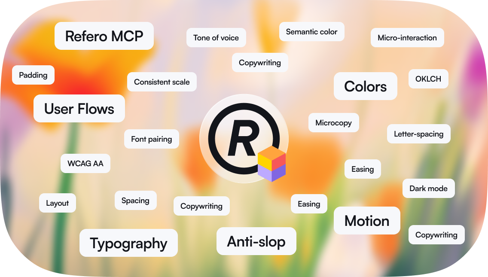

# Refero Design Skill

**Design with data, not defaults.**

AI agents design from training data averages. Generic layouts, safe colors, patterns you've seen a thousand times. This skill gives your agent something it never had: access to real design research.

## Install

Works with Claude Code, Cursor, Gemini CLI, Lovable, and any MCP-compatible agent.

```bash
npx skills add referodesign/refero_skill
```

That's it. All craft knowledge — typography, color, anti-slop rules, copywriting, methodology — loads into your agent immediately. No account required.

<details>
<summary>Troubleshooting</summary>

```bash
npx skills add referodesign/refero_skill --agent cursor
```

Or clone:
```bash
git clone https://github.com/referodesign/refero_skill.git .cursor/skills/refero-design
```

</details>

---

## What's in the skill

**Real-time design research.** Before creating anything, your agent searches [Refero](https://refero.design): 150,000+ screens and 6,000+ user flows from Stripe, Linear, Notion, Figma, Vercel, and thousands of the best products ever built. Every screen has rich metadata: components, patterns, typography, colors, layout structures. User flows are broken down step by step. Semantic search finds anything — pricing pages, onboarding flows, dark mode dashboards, cancellation flows. Research that takes designers hours, done in seconds. Requires [Refero Pro](#unlock-live-design-research).

**Craft knowledge.** Deep guides on typography, color, spacing, motion, and icons. Letter-spacing rules, color token systems, animation timing curves. The details that separate polished products from rough prototypes.

**Anti-slop rules.** Explicit guidance to avoid the generic AI look: no default indigo, no blob backgrounds, no hero-features-pricing-FAQ templates. What makes design feel human versus generated.

**Copywriting.** UI copy principles, microcopy patterns for buttons, errors, and empty states. A banned-words list that cuts corporate zombie language and AI slop markers.

**Methodology.** A complete workflow from discovery questions through research, analysis, and implementation. Quality gates and side-by-side validation against real products.

<details>
<summary>Files</summary>

**SKILL.md** — Research-First methodology
- Discovery questions before designing
- Research strategies and query patterns
- Analysis frameworks and steal lists
- Design craft summaries
- Quality gates and validation

**Reference guides:**
- `typography.md` — Scale, pairing, letter-spacing, line-height
- `color.md` — Palettes, tokens, dark mode, contrast
- `motion.md` — Timing, easing, micro-interactions
- `icons.md` — Sizing, optical corrections, libraries
- `craft-details.md` — Focus states, forms, accessibility
- `anti-ai-slop.md` — Avoiding the generic AI look
- `copywriting.md` — UI copy, microcopy, and banned words
- `mcp-tools.md` — Refero API reference
- `example-workflow.md` — Complete design walkthrough

</details>

---

## Unlock live design research

To give your agent live access to 150,000+ real app screens and 6,000+ user flows, connect the Refero MCP.

**Step 1 — Get Refero Pro**

Go to [refero.design/mcp](https://refero.design/mcp) and activate a Pro subscription.

**Step 2 — Connect your tool**

<details id="unlock-live-design-research">
<summary>Claude Code</summary>

```bash
claude mcp add --transport http refero https://api.refero.design/mcp --header "Authorization: Bearer <token>"
```

</details>

<details>
<summary>Cursor</summary>

Add to `.cursor/mcp.json`:
```json
{
  "mcpServers": {
    "refero": {
      "url": "https://api.refero.design/mcp",
      "headers": { "Authorization": "Bearer <token>" }
    }
  }
}
```

</details>

<details>
<summary>Gemini CLI</summary>

```bash
gemini mcp add --transport http refero https://api.refero.design/mcp --header "Authorization: Bearer <token>"
```

</details>

<details>
<summary>Lovable</summary>

Settings → Connectors → New MCP server → `https://api.refero.design/mcp` → Bearer token

</details>

<details>
<summary>Other tools</summary>

```
URL: https://api.refero.design/mcp
Auth: Bearer <token>
```

</details>

The first time you call Refero, a browser window opens to sign in. After that it's automatic.

## License

MIT
